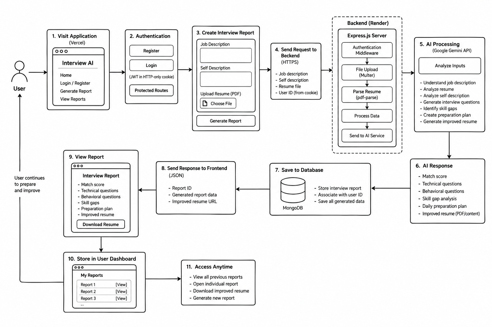

# Interview AI

> AI-powered interview preparation platform that helps you understand a job description, identify skill gaps, prepare targeted interview questions, and improve your resume.

...

## Project Flow

## Tech Stack

...

## Live Demo

**Frontend:**  
https://interview-ai-two-lemon.vercel.app

**Backend:**  
https://interview-ai-w6wz.onrender.com

---

## Overview

Interview AI is a full-stack web application designed to make interview preparation more personalized and practical.

Instead of preparing generic interview questions, the application analyzes the candidate's:

- Job Description
- Resume
- Self Description

and uses AI to generate a personalized interview preparation report.

The report provides targeted interview questions, skill-gap analysis, a preparation roadmap, and an improved ATS-friendly resume.

---

## Features

- User registration and login
- JWT-based authentication
- Secure authentication using HTTP-only cookies
- Password hashing with bcrypt
- Protected routes
- Personalized interview report generation
- Job description analysis
- Resume parsing and analysis
- Self-description analysis
- AI-generated technical interview questions
- AI-generated behavioral interview questions
- Skill-gap analysis
- Personalized daily preparation plan
- AI-improved ATS-friendly resume
- Downloadable improved resume
- User-specific interview reports
- View all previously generated reports
- Individual interview report pages
- Responsive and modern UI
- Deployed frontend and backend

---

## How It Works

    User
      │
      ▼
    Login / Register
      │
      ▼
    Enter Job Details
      │
      ├── Job Description
      ├── Self Description
      └── Resume
      │
      ▼
    Express Backend
      │
      ▼
    Resume Parsing & Analysis
      │
      ▼
    Google Gemini AI
      │
      ├── Interview Questions
      ├── Behavioral Questions
      ├── Skill Gap Analysis
      ├── Preparation Plan
      └── Resume Improvement
      │
      ▼
    Interview Report
      │
      ├── Current Report
      └── All Reports

---

## Tech Stack

### Frontend

- React
- React Router
- Tailwind CSS
- Axios
- React Hooks
- Context API
- Vercel

### Backend

- Node.js
- Express.js
- MongoDB
- Mongoose
- JWT
- HTTP-only Cookies
- bcrypt
- Multer
- pdf-parse
- Render

### AI

- Google Gemini API

---

## Project Architecture

The project follows a full-stack client-server architecture.

    Interview AI
    │
    ├── Frontend
    │   ├── React
    │   ├── React Router
    │   ├── Tailwind CSS
    │   ├── Context API
    │   └── Axios
    │
    ├── Backend
    │   ├── Node.js
    │   ├── Express.js
    │   ├── Controllers
    │   ├── Models
    │   ├── Routes
    │   └── Middleware
    │
    ├── Database
    │   └── MongoDB
    │
    └── AI
        └── Google Gemini API

---

## Authentication Flow

Interview AI uses JWT-based authentication with HTTP-only cookies.

    User
      │
      ▼
    Login / Register
      │
      ▼
    Backend validates credentials
      │
      ▼
    JWT generated
      │
      ▼
    JWT stored in HTTP-only cookie
      │
      ▼
    Protected API requests
      │
      ▼
    Authentication middleware
      │
      ▼
    User identified from JWT

HTTP-only cookies help prevent client-side JavaScript from directly accessing the authentication token.

---

## Interview Report Flow

When a user generates a report:

1. The user submits a job description.
2. The user provides a self-description.
3. The user uploads their resume.
4. The backend receives the multipart form data.
5. Multer processes the uploaded file.
6. The resume is parsed using `pdf-parse`.
7. The backend sends the relevant information to Gemini.
8. Gemini generates the interview preparation data.
9. The generated report is stored in MongoDB.
10. The report is associated with the authenticated user.
11. The frontend redirects the user to the generated report.

Each report is connected to its owner through the user's MongoDB ObjectId.

---

## Report Data

Each interview report can contain information such as:

- Job description
- Resume
- Self description
- Match score
- Technical questions
- Behavioral questions
- Skill gaps
- Preparation plan
- Improved resume
- Creation timestamp
- Associated user

---

## User-Specific Reports

Reports are associated with the authenticated user.

The backend uses the authenticated user's ID to retrieve only that user's reports.

    Authenticated User
           │
           ▼
       req.user._id
           │
           ▼
    Interview Report
           │
           ▼
    Find reports where
    user === req.user._id

This allows the reports page to display the user's own interview history.

---

## API Overview

### Authentication

    POST   /api/auth/register
    POST   /api/auth/login
    GET    /api/auth/getuser
    GET    /api/auth/logout

### Interview

    POST   /api/interview
    GET    /api/interview/reports
    GET    /api/interview/:interviewID
    GET    /api/interview/improved-resume/:interviewID

---

## Frontend Setup

Clone the repository and move into the project directory.

    git clone <your-repository-url>
    cd <project-directory>

Install dependencies:

    npm install

Start the development server:

    npm run dev

The frontend will then run on the local development URL provided by Vite.

---

## Backend Setup

Move into the backend directory:

    cd backend

Install dependencies:

    npm install

Start the backend:

    npm start

Or, if using a development script:

    npm run dev

---

## Environment Variables

### Backend

Create a `.env` file in the backend directory.

    MONGO_URI=your_mongodb_connection_string
    JWT_SECRET=your_jwt_secret
    GEMINI_API_KEY=your_gemini_api_key

Use your own values for all environment variables.

Never commit the `.env` file to GitHub.

---

## Frontend API Configuration

The frontend communicates with the Express backend through Axios.

For production, the frontend uses the deployed backend:

https://interview-ai-w6wz.onrender.com

For local development, the API can point to the local Express server.

---

## Deployment

### Frontend

The frontend is deployed using Vercel.

Live frontend:

https://interview-ai-two-lemon.vercel.app

### Backend

The backend is deployed using Render.

Live backend:

https://interview-ai-w6wz.onrender.com

### Database

MongoDB is used as the application's persistent database.

---

## Security

The project implements several authentication and security practices:

- JWT-based authentication
- HTTP-only authentication cookies
- Password hashing with bcrypt
- Protected frontend routes
- Protected backend routes
- User-specific report access
- Environment variables for sensitive credentials
- Authentication middleware for protected API requests

Sensitive credentials such as database URLs, JWT secrets, and Gemini API keys should never be committed to the repository.

---

## Project Goals

The main goal of Interview AI is to provide a practical AI-powered interview preparation workflow rather than generic interview advice.

The application focuses on connecting the candidate's actual resume and target job description to the preparation process.

This makes the generated preparation more relevant to the specific role the candidate is applying for.

---

## Future Improvements

Possible future improvements include:

- Interview simulation mode
- AI-powered mock interviews
- Voice-based interview practice
- Real-time interview feedback
- Interview performance tracking
- More detailed analytics
- Better resume scoring
- Job-specific preparation recommendations
- Interview report comparison
- Improved mobile experience
- More AI model options
- Advanced report filtering and searching

---

## Learning Outcomes

This project helped demonstrate practical experience with:

- Building a full-stack React application
- Designing REST APIs with Express
- MongoDB and Mongoose
- JWT authentication
- HTTP-only cookies
- Password hashing
- Protected routes
- File uploads
- PDF parsing
- AI API integration
- React state management
- React Context API
- API communication with Axios
- Frontend-backend integration
- Deployment using Vercel and Render
- Working with environment variables
- Building user-specific data flows

---

## Project Flow

    Register
       │
       ▼
    Login
       │
       ▼
    Authenticated Home
       │
       ├──────────────────┐
       │                  │
       ▼                  ▼
    Generate Report    View Reports
       │                  │
       ▼                  ▼
    Upload Resume      User Reports
       │
       ▼
    Enter Job Details
       │
       ▼
    AI Analysis
       │
       ▼
    Interview Report
       │
       ├── Match Score
       ├── Technical Questions
       ├── Behavioral Questions
       ├── Skill Gaps
       ├── Preparation Plan
       └── Improved Resume

---

## Live

**Interview AI:**  
https://interview-ai-two-lemon.vercel.app

---

## Author

**Navneet**

Software Engineer | Full-Stack Developer

Built with React, Node.js, Express, MongoDB, and Google Gemini AI.

---

## License

This project is licensed under the MIT License.